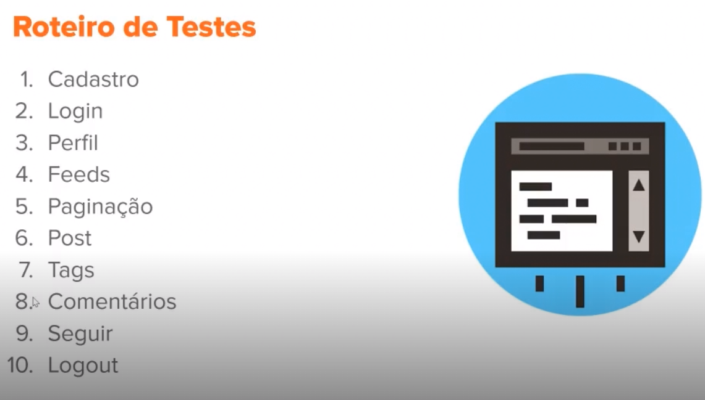

# Utilizando o Cypress E2E para testar um Blog em Angular 

- Cypress é uma ferramenta web
- Você não precisa programar todos os testes 
- executa em um navegador 
- nao automatiza todos os testes 
- aplicativo real-world example 

- git clone https://github.com/gothinkster/angular-realworld-example-app.git
- npm i 

-- dev só serve para desenvolvimento 

- npm install cypress --save-dev

- npx cypress -v 

- npm uninstall --save-dev protrector 
- deletamos o diretorio e2e
- do package.json remover o e2e : nge2e 
- npx cypress open

- criaremos testes personalisados 

- dentro do cypress -> integration -> 

``` Js 
describe ('Primeiro TEste', ()) => {
    it('Exemplos Cypress'), () => {
        cy.visit('site')
        expect(true).to.equal(true)
    })
})
```
- describe : Agrupamento 
- it realmente o teste 

-
- cypress.json  (configs do cypress)




- podemos usar o cypress recorder para gravar os testes 
baixei a extensão cypress recorder do chrome 

- criou um arquivo dentro de integration 
- cadastro.spec 
- visitou o localhost -> signup 
- fiz o login com um valor qquer 
- clico em stop recorder 
- copia a lista de comandos que foram executados quando ele tentou gerar um cadastro de usuarios

```Js
define ( '' ,() => {
        if ('',() => {

            cy.visit('http://localhost:4200/register');
            cy.get('.ng-pristine > fieldset').click();
            cy.get('.ng-valid').click();
            cy.get('.ng-valid').type('paulomarinho');
            cy.get('.form-group:nth-child(2) > .form-control').type('paulo');
            cy.get('.form-group:nth-child(2) > .form-control').type('paulomarinho@compasso.com.br');
            cy.get('.ng-untouched').type('123deoliveira4');
            cy.get('.btn').click();
            cy.get('.ng-touched:nth-child(4)').submit();
            cy.get('html').click();
            cy.get('.auth-page').click();
            cy.get('.form-group:nth-child(1) > .form-control').type('luiz');
            cy.get('.form-group:nth-child(2) > .form-control').type('luiz@gmail.com');
            cy.get('.form-group:nth-child(3) > .form-control').type('luiz123');
            cy.get('.btn').click();
            cy.get('.ng-touched:nth-child(4)').submit();
            cy.get('.form-group:nth-child(2) > .form-control').click();
            cy.get('.form-group:nth-child(2) > .form-control').type('luizrosalba@gmail.com');
            cy.get('.form-group:nth-child(1) > .form-control').click();
            cy.get('.form-group:nth-child(1) > .form-control').type('luizrosalba');
            cy.get('.btn').click();
            cy.get('.ng-touched:nth-child(4)').submit();
            cy.get('.row').click();
            cy.get('.form-group:nth-child(3) > .form-control').type('luiz1234');
            cy.get('.btn').click();
            cy.get('.ng-touched:nth-child(4)').submit();

        })
    })

```
- poderiamos também fazer o processo na mao 

- ao fazer o teste ele grava os videos na pasta cadastro.spec.mp4

- no projeto o ideal é retirar a pasta examples 
- npm cypress run --spec caminhoatéospec
- validou o post , o perfil , a paginação , o login e o cadastro 
- antes de qquer teste ele pode logar e deslogar na aplicação 
- cy.login(email,senha)
- plugins para gerar relatórios amigáveis em HTML , JSOn , personalizáveis 
- mochawesome-report-generator 

- Quality gate deixa o código passar ou nao 


# DEvOPS 

cypress run [--record] [--key dashboard-key]


